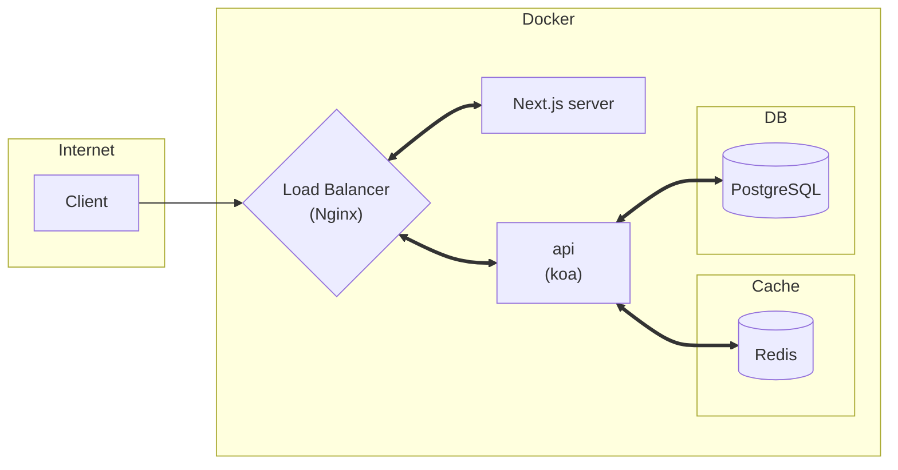

# **url-shortener-backend**

## **Overview of the Architecture**


## **Setup**
### 1. Download the both frontend and backend projects: 
```bash
git clone git@github.com:Retr0327/URL-shortener-frontend.git
git@github.com:Retr0327/URL-shortener-backend.git
```
Hence, the project strucutre should look like this: 

```
URL-shortener-frontend\        
 |-- public\              # Some static files
 |-- src\                 # Source files
 |-- ...
URL-shortener-backend\
 |-- deployment\          # Deployment folder
 |-- src\                 # Source files
 |-- test\                # Automated tests
 |-- ...
```

### 2. Use docker to run:
Install docker, and use the following command to run:

> Remember to run the command in the backend folder!
 
```bash
docker compose up 
```

## **Performance (with pm2)**
This project is managed by [pm2](https://pm2.keymetrics.io/), which helps manage Node apps and restarts them once they failed, and this project is set to the cluster mode, allowing the application to be scaled across all CPUs available. 

We can run a load test on the localhost (once we run the `docker compose up` command):

```bash 
loadtest -P '{"url":"https://github.com/Retr0327", "expireDate":"2022-04-29T13:05:20.331Z"}' -n 10 -c 10000 http://localhost/
```
This prints:

```bash 
INFO Target URL:      http://localhost/
Max requests:         10
Concurrency level:    10000
...
Completed requests:   10
Total errors:         0
Total time:           0.269094041 s
Requests per second:  37
Mean latency:         212.2 ms
```

If we test the server without pm2 cluster mode:

```bash 
INFO Target URL:      http://localhost/
Max requests:         10
Concurrency level:    10000
...
Completed requests:   10
Total errors:         0
Total time:           0.695564584 s
Requests per second:  14
Mean latency:         654 ms
```
The time for server to handle 10 requests from each 10000 clients has reduced from 0.695564584 s to 0.269094041 s, and the server response time has dropped from 654 ms to 212.2 ms, which is roughly twice as fast overall.  


## Contact Me
If you have any suggestion or question, please do not hesitate to email me at r07142010@g.ntu.edu.tw