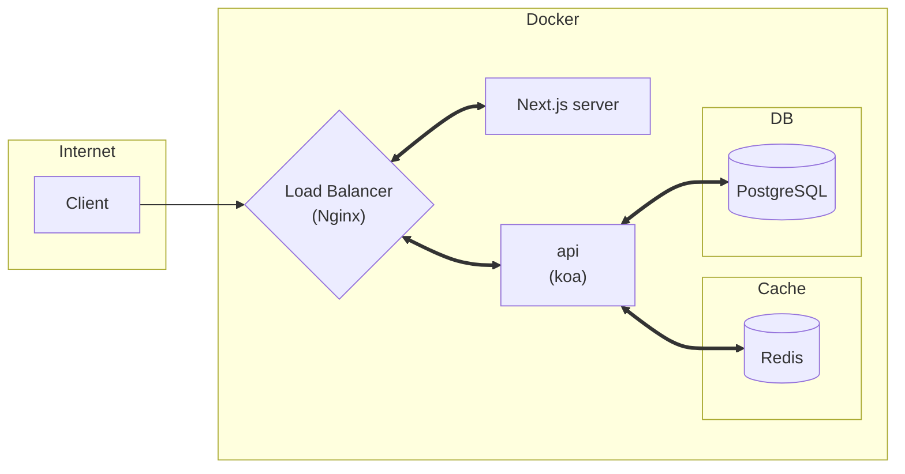

# **url-shortener-backend**

## **Overview of the Architecture**

```mermaid 
flowchart LR
subgraph Internet
    D[Client]
end

subgraph DOCKER [Docker]

  D --> N{"Load Balancer <br/> (Nginx)"}

  N <==> B[Next.js server]
  N <==> C["<div style='padding: 0rem 1rem;'>api <br/> (koa) </div>  "]

  C <==> R
  C <==> G

  subgraph Cache
    style Cache margin-top: 100
        R[("<div style='padding: 0rem 0.5rem;'>Redis </div>  ")]
  end

   subgraph DB
    style Cache margin-top: 100
        G[(PostgreSQL)]
  end
end

```